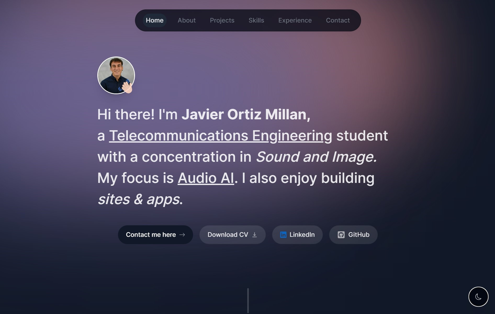

# 💻 My Personal Portfolio

<div align="center">
  <a href="https://javierortizmi.com" target="_blank"></a>
</div>

<div align="center">
    <a href="#" target="_blank">
        Preview
    </a>
    <span>&nbsp;✦&nbsp;</span>
    <a href="#-getting-started">
        Getting Started
    </a>
    <span>&nbsp;✦&nbsp;</span>
    <a href="#-commands">
        Commands
    </a>
    <span>&nbsp;✦&nbsp;</span>
    <a href="#-license">
        License
    </a>
</div>

## Overview

Project based in [ByteGrad](https://github.com/ByteGrad) portfolio-website. I wanted to create a nice-looking animated portfolio that shows the most important information about me and skills.

This website was built with React & Next.js (App Router & Server Actions), Typescript, Tailwind CSS, Framer Motion, React Email & Resend, Vercel hosting.

[](https://javierortizmi.com)

## 🛠️ Stack

[](https://react.dev/)
[](https://www.typescriptlang.org/)
[](https://nextjs.org/)
[](https://tailwindcss.com/)
[](https://www.framer.com/)
[](https://vercel.com/)

## 🚀 Getting Started

1. [Fork](https://github.com/javierortizmi/PersonalPortfolio/fork) or clone this repository.

```bash
git clone https://github.com/javierortizmi/PersonalPortfolio.git
```

2. Install the dependencies:

- You can use [bun](https://bun.sh) to install and manage the dependencies.

```bash
# Install bun for MacOS, WSL & Linux:
curl -fsSL https://bun.sh/install | bash

# Install bun for Windows:
powershell -c "iwr bun.sh/install.ps1|iex"

# Install dependencies with bun:
bun install
```

- or you can use [pnpm](https://pnpm.io):

```bash
# Install pnpm globally if you don't have it:
npm install -g pnpm

# Install dependencies with pnpm:
pnpm install
```

- or simply use [npm](https://www.npmjs.com/)

```bash
# Install dependencies with npm:
npm install
```

3. Create the `.env.local` file and add the `RESEND_API_KEY` to it.

```bash
RESEND_API_KEY=your_resend_api_key
```

4. Run the development server:

```bash
# Run with bun:
bun dev

# Run with pnpm:
pnpm dev

# Run with npm:
npm run dev
```

5. Open [**http://localhost:3000**](http://localhost:3000/) with your browser to see the result 🚀

</a>

## 🧞 Commands

|     | Command          | Action                                        |
| :-- | :--------------- | :-------------------------------------------- |
| ⚙️  | `dev` or `start` | Starts local dev server at `localhost:3000`.  |
| ⚙️  | `build`          | Build your production site.                   |
| ⚙️  | `preview`        | Preview your build locally, before deploying. |

## 🔑 License

<div style="display:flex;flex-direction: column;">
  <a href="LICENSE"></img></a>
  <p>Created by <a href="https://javierortizmi.com"><b>Javier Ortiz</b></a></p>
</div>

## ✅ To Do

- [ ] Add internationalization functionality.
